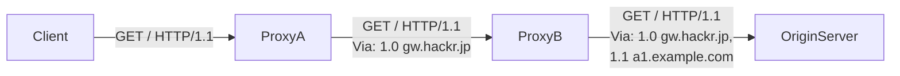

# 6장 HTTP 헤더
HTTP의 리퀘스트와 리스폰스에는 HTTP 헤더가 포함되어 있다. HTTP 헤더 구조와 각 헤더 필드의 역할에 대해 살펴보자.

<br>

## HTTP 메시지 헤더
  

- HTTP 프로토콜의 리퀘스트와 리스폰스에는 메시지 헤더가 포함되어 있다.
- 메시지 헤더에는 클라이언트나 서버가 리퀘스트나 리스폰스를 처리하기 위한 정보가 들어있다.

<br>

### 리퀘스트의 HTTP 메시지
- 메소드, URI, HTTP 버전, HTTP 헤더 필드 등으로 구성되어 있다.

<br>

### 리스폰스의 HTTP 메시지
- HTTP 메시지와 HTTP 버전, 상태 코드(코드+설명), HTTP 헤더 필드 등으로 구성되어 있다.

<br>

## HTTP 헤더 필드
- HTTP 헤더 필드는 리퀘스트에도 리스폰스에도 사용되고 있고, 부가적으로 중요한 정보를 전달하는 역할을 담당한다.
- HTTP 헤더 필드의 구조는 다음과 같다.
> 헤더 필드 명 : 필드 값  
> Content-Type : text/html
- 하나의 HTTP 헤더 필드가 여러 개의 필드를 가질 수 있다.
> Keep-Alive : timeout=15, max=100
- 헤더 필드가 중복되는 경우 브라우저에 다라 다른 동작을 하게 된다.

<br>

### 4종류의 HTTP 헤더 필드
- **일반적 헤더 필드**
    - 리퀘스트, 리스폰스 메시지에서 사용되는 헤더다.
- **리퀘스트 헤더 필드**
    - 클라이언트에서 서버에게 송신한 리퀘스트 메시지에 사용되는 헤더다.
    - 리퀘스트의 부가적 정보, 클라이언트의 정보, 리스폰스의 콘텐츠에 관한 우선 순위 등을 부가한다.
- **리스폰스 헤더 필드**
    - 서버에서 클라이언트로 송신한 리스폰스 메시지에 사용되는 헤더다.
    - 리스폰스의 부가적 정보, 클라이언트의 추가 정보 요구 등을 부가한다.
- **엔티티 헤더 필드**
    - 리퀘스트, 리스폰스 메시지에서 사용되는 헤더다.
    - 콘텐츠 갱신 시간 등의 엔티티에 관한 정보를 부가한다.

<br>

### End-to-end 헤더 & Hop-by-hop 헤더
- **End-to-end 헤더**
    - 이 카테고리에 분류된 헤더는 리퀘스트나 리스폰스의 최종 수신자에게 전송된다.
    - 캐시에서 구축된 리스폰스 중 보존되어야 하고, 다시 전송되지 않으면 안되도록 되어 있다.
- **Hop-by-hop 헤더**
    - 이 카테고리에 분류된 헤더는 한 번 전송에 대해서만 유효하고 캐시와 프록시에 의해 전송되지 않는 것도 있다.
    - HTTP/1.1과 그 이후에서 사용되는 Hop-by-hop 헤더는 Connection 헤더 필드에 열거해야 한다.
    - Connection, Keep-Alive, Proxy-Authenticate, Proxy-Authorization, Trailer, TE, Transfer-Encoding, Upgrade (이외에는 모두 End-by-end 헤더에 분류된다.)

<br>

## HTTP/1.1 일반 헤더 필드
- 리퀘스트, 리스폰스 모두에서 사용되는 헤더다.

<br>

### Cache-Control
- 디렉티브로 불리는 명령을 사용하여 캐싱 동작을 지정한다.
- 캐시가 가능한지 여부를 나타내는 디렉티브
    > Cache-control: public
    - 다른 유저에게도 돌려줄 수 있는 캐시를 해도 좋다는 것을 명시적으로 나타냄
    > Cache-control: private
    - 리스폰스는 특정 유저만을 대상으로 하고 있다는 것을 나타낸다.
    - 특정 유저를 위해 리소스를 캐시할 수 있지만, 다른 유저로부터 같은 리퀘스트가 온다고 하더라도 그 캐시를 반환하지 않도록 한다.
    > Cache-control: no-cache
    - 오래된 리소스가 반환되는 것을 막기 위해 사용된다.
    - 클라이언트가 no-cache를 사용하면 캐시된 리스폰스가 아니라 오리진 서버에서 받아온 리스폰스를 반환해달라고 하는 것이다.
    - 서버의 리스폰스에서 no-cache를 사용하면 캐시 서버는 리소스를 저장할 수 없다.
    > Cache-control: no-cache=Location
    - 지정된 헤더 필드만 캐시할 수 없다.
    - 이 파라미터는 리스폰스에서만 사용할 수 있다.
- 캐시로 보존 가능한 것을 제어하는 디렉티브
    > Cache-control: no-store
    - 리퀘스트 혹은 리스폰스에 기밀 정보가 포함되어 있음을 나타낸다.
- 캐시 기한이나 검증을 지정하는 디렉티브
    > Cache-control: s-maxage=605800
    - 여러 유저가 이용할 수 있는 공유 캐시 서버에만 적용된다.
    - 이 디렉티브를 사용하는 경우, Expires 헤더 필드와 max-age 디렉티브는 무시된다.
    > Cache-control: max-age=604800
    - 리퀘스트에서 사용하면 지정된 값보다 새로운 값이면 캐시된 리소스를 받아들인다.
    - 지정한 값이 0이면 캐시 서버는 리퀘스트를 항상 오리진 서버에 넘길 필요가 있다.
    - 리스폰스에서 사용하면 캐시 서버가 유효성을 재확인하지 않고 리소스를 캐시에 보존해 두는 최대 기간을 나타낸다.
    - HTTP/1.1 캐시 서버는 동시에 Expires 헤더 필드가 달린 경우 max-age 디렉티브의 지정을 우선하고, Expires 헤더 필드를 무시한다.
    - HTTP/1.0 캐시 서버는 반대로 max-age 디렉티브가 무시된다.
    > Cache-control: min-fresh=60
    - 캐시된 리소스가 적어도 지정된 시간동안은 유효한 값으로 반환한다.
    > Cache-control: max-stale=3600
    - 캐시된 리소스의 유효 기한이 끝났더라도 받아들일 수 있음을 나타낸다.
    - 지정되어 있지 않는 경우 클라이언트는 리스폰스를 무조건 받아들인다.
    - 지정되어 있는 경우 유효 기한이 지난 후부터 지정한 시간 이내면 받아들인다는 뜻이다.
    > Cache-control: only-if-cached
    - 목적하는 리소스가 캐시되어 있는 경우만 리스폰스를 반환하도록 요구한다.
    - 캐시 서버에서 리스폰스의 리로드와 유효성을 재확인하지 않도록 요구한다.
    - 캐시 서버에 로컬 캐시로부터 응답할 수 없는 경우 "504 Gateway Timeout" 상태를 반환한다.
    > Cache-control: must-revalidate
    - 리스폰스의 캐시가 현재도 유효한지 아닌지의 여부를 오리진 서버에 조회를 요구한다.
    - 프록시가 오리진 서버에 도달할 수 없고, 리소스를 다시 요구할 수 없는 경우 캐시는 "504 Gateway Timeout" 을 반환한다.
    > Cache-control: proxy-revalidate
    - 모든 캐시 서버에 대해 이후의 리퀘스트로 해당 리스폰스를 반환할 때 반드시 유효성을 재확인 하도록 요구한다.
    > Cache-control: no-transform
    - 캐시가 엔티티 바디의 미디어 타입을 변경하지 않도록 지정한다.
    - 캐시 서버 등에 의해 이미지가 압축되는 것을 방지한다.

<br>

### Connection
- Connection 헤더 필드는 다음의 두 가지 역할을 한다.
    - 프록시에 더 이상 전송하지 않는 헤더 필드를 지정
    - 지속적 접속 관리
- **프록시에 더 이상 전송하지 않는 헤더 필드를 지정**
    > Connection: 더 이상 전송하지 않는 헤더 필드 명
    ```mermaid
    flowchart LR
    Client--> |
    GET / HTTP/1.1
        Upgrade: HTTP/1.1
        Connection: Upgrade
    |Proxy--> |
    GET / HTTP/1.1
    |Server
    ```
    - Connection에 전송하지 않는 헤더 필드 Upgrade가 있어 프록시에서 서버로 전송할 때는 Upgrade 필드를 제외하고 보낸다.

- **지속적 접속 관리**
    > Connection: Close
    - HTTP/1.1 에서는 지속적 접속이 디폴트다.
    - 때문에 클라이언트는 접속이 계속 유지되면서 추가 리퀘스트를 송신하도록 한다.
    - 서버에서 명시적으로 접속을 끊고 싶은 경우 Connection 헤더 필드에 Close라고 지정한다.
    > Connection: Keep-Alive
    - HTTP/1.1 이전 버전의 HTTP에서는 지속적 접속이 디폴트가 아니었다.
    - 때문에 오래된 버전의 HTTP에서 지속적 접속을 하고 싶은 경우 Connection 헤더 필드에 Keep-Alive라고 지정해야 한다.
    ```mermaid
    flowchart LR
    Client --> |
    GET / HTTP/1.1
    Connection: Keep-Alive
    | Server

    Server --> |
    HTTP/1.1 200 OK
    ...
    Keep-Alive: timeout=10, max=5000
    Connection: Keep-Alive
    | Client
    ```

<br>

### Date
- HTTP 메시지를 생성한 날짜를 나타낸다.
- HTTP/1.1 에서는 다음과 같이 날짜 포맷이 지정되어 있다.
> Date: Tue, 03 Jul 2012 04:40:59 GMT

<br>

### Pragma
- HTTP/1.1 보다 오래된 버전의 흔적으로 HTTP/1.0과 후방 호환성만을 위해 정의되어 있는 헤더 필드다.
- 지정할 수 있는 형식은 1개 뿐이다.
> Pragma: no-cache
- 클라이언트의 리퀘스트에서만 사용된다.

<br>

### Trailer
- 메시지 바디의 뒤에 기술되어 있는 헤더 필드를 미리 전달할 수 있다. 
- HTTP/1.1에 구현되어 있는 청크 전송 인코딩을 사용하는 경우 사용할 수 있다.

<br>

### Transfer-Encoding
- 메시지 바디의 전송 코딩 형식을 지정하는 경우 사용된다.
- HTTP/1.1 에서 전송 코딩 형식으로 청크 전송만이 정의되어 있다.

<br>

### Upgrade
- HTTP 및 다른 프로토콜의 새로운 버전이 통신에 이용되는 경우 사용된다.
- 지정하는 대상이 다른 통신 프로토콜이라도 상관없다.

<br>

### Via
- 리퀘스트나 리스폰스의 경로를 알기 위해 사용한다.
- 프록시 혹은 게이트웨이는 자신의 서버 정보를 Via 필드 뒤에 추가한 뒤 메시지를 전송한다.
- 전송된 메시지의 추적과 리퀘스트 루프의 회피 등에 사용되기 떄문에 프록시를 경유하는 경우 반드시 부가해야 한다.

- 각각의 프록시 서버가 자기 자신의 정보를 Via 헤더에 추가한다.
- 배송 경로를 알기 위해 TRACE 메서드와 연계해서 자주 사용된다.

<br>

### Warning
- HTTP/1.0 리스폰스 헤더(Retry-After)가 HTTP/1.1에서 변경된 것이다.
- 캐시에 관한 문제의 경고를 유저에게 전달한다.

<br>

## 리퀘스트 헤더 필드
- 클라이언트에서 서버로 송신된 리퀘스트 메시지 헤더로 사용되는 필드다.

<br>

### Accept
- 처리할 수 있는 미디어 타입과 미디어 타입의 상대적은 우선 순위를 전달하기 위해 사용된다.
- 미디어 타입의 지정은 "타입/서브타입"으로 한 번에 려버 번 설정할 수 있다.
- > Accept: text/html, application/xhtml+xml,application/xml;q=0.9,*/*;q=0.8

<br>

### Accept-Charset
- 처리할 수 있는 문자셋이며 문자셋의 상대적인 우선 순위를 전달하기 위해 사용한다.
- 서버 구동형 네고시에이션에 이용된다.
- > Accept-Charset:iso-8859-5, unicode-1-1:q+0.8

<br>

### Accept-Endcoding
- 처리할 수 있는 콘텐츠 코딩과 콘텐츠 코딩의 우선 순위를 전달한다.
- > Accept-Encoding: gzip, deflate

<br>

### Accept-Language
- 처리할 수 있는 자연어 세트와 우선 순위를 전달한다.
- 품질 지수에 의해 우선 순위를 ㅈ지ㅓㅇ할 수 있다.
- > Accept-Language: ko-kr, en-us;q=0.7,en;q=0.3

<br>

### Authorization
- 인증 정보를 전달하기 위해 사용된다.
- > Authrization: Basic dWVub3N...

<br>

### Expect
- 클라이언트가 서버에 특정 동작 요구를 전달한다.
- > Expect: 100-continue

### From
- 사용하고 있는 유저의 메일 주소를 전달한다.

<br>

### Host
- 리퀘스트한 인터넷 호스트와 포트 번호를 전달한다.
- HTTP/1.1에서 유일한 필수 헤더 필드다.
- 1대의 서버에서 복수의 도메인을 할당할 수 있는 가상 호스트의 구조와 연관이 있다.
- 리퀘스트가 서버에 오면 호스트 명을 IP 주소로 해결해 리퀘스트가 처리되는데, 같은 IP 주소로 복수의 도메인이 적용되어 있다고 하면 어느 도메인에 대한 리퀘스트인지 알 수 없다. 그래서 Host 필드에 호스트명을 명확하게 하는 것이다.

<br>

### If-Match
- If-xxx 는 조건부 리퀘스트다.
- 조건부 리퀘스트는 지정된 조건에 맞는 경우에만 리퀘스트를 받는다.

<br>

### If-Modified-Since
- 조건부 리퀘스트의 하나로 리소스가 갱신 날짜보다 필드 값보다 새롭지 않다면 리퀘스트를 받아들이겠다는 뜻이다.
- > If-Modified-Since: Thu, 15 Apr 2004 00:00:00 GMT

<br>

### If-None-Match
- 조건부 리퀘스트의 하나로 If-Match와 반대로 동작한다.

<br>

### If-Range
- 조건부 리퀘스트의 하나로 If-Range로 지정한 필드 값과 지정한 리소스의 ETag 값 혹은 날짜가 일치하면 Range 리퀘스트로 처리하고 싶다는 것을 전달한다.

<br>

### If-Unmodified-Since
- If-Modified-Since와 반대 동작을 한다.
- 지정된 리소스가 필드 값에 지정된 날짜 이후에 갱신된 경우 412를 반환한다.
- > If-Unmodified-Since: Thu, 03 Jul 2012 00:00:00 GMT

<br>

### Max-Forwards
- TRACE, OPTIONS 메소드에 의한 리퀘스트를 할 때 전송해도 좋은 서버 수의 최대치를 10진수 정수로 지정한다.
- Max-Forwards의 값이 0인 리퀘스트를 받은 경우 전송하지 않고 리스폰스를 반환해야 한다.
- > Max-Forwards: 10

<br>

### Proxy-Authorization
- 프록시 서버에서의 인증 요구를 받아들일 때 인증에 필요한 클라이언트의 정보를 전달한다.
- 클라이언트와 프록시 사이에 인증잉 ㅣ루어진다.
- > Proxy-Authorization: Basic dGlW...

<br>

### Range
- 리소스의 일부분만 취득하는 Range 리퀘스트를 할 때 지정 범위를 전달한다.
- > Range: bytes=5001-10000

<br>

### TE
- 리스폰스로 받을 수 있는 전송 코딩의 형식과 상대적인 우선순위를 전달한다.
- 전송 코딩의 지정 이외에 Trailer를 동반하는 청크 전송 인코딩 형식을 지정하는 것이 가능하다.
- > TE: gzip, deflate;q=0.5

<br>

### User-Agent
- 리퀘스트를 생성한 브라우저와 유저 에이전트의 이름 등을 전달하기 위한 필드다.
- > User-Agent:Mozilla/5.0 (Windows NT 6..1)...

<br>

## 리스폰스 헤더 필드
- 서버에서 클라이언트로 송신되는 리스폰스의 메시지에 적용된 헤더다.

<br>

### Accept-Ranges
- 서버가 리소스의 일부분만 지정해서 취득할 수 있는 Range 리퀘스트를 접수할 수 있는지 여부를 전달한다.
- 지정 가능한 값은 2개이며, bytes, none이다.
- > Accept-Ranges: bytes

<br>

### Age
- 얼마나 오래 전에 오리진 서버에서 리스폰스가 생성되었는지를 전달한다.
- 단위는 초다.
- 
- > Age: 600

<br>

### ETag
- 엔티티 태그라고 불리며 일의적으로 리소스를 특정하기 위한 문자열을 전달한다.
- 서버는 리소스마다 ETag 값을 할당한다.
- > ETag: "83e..."

<br>

### Location
- 리스폰스의 수신자에 대해 Request-URI 외의 리소스 액세스를 유도하는 경우 사용된다.
- Location 헤더 필드를 포함한 리스폰스를 받으면 강제로 리다이렉트 하는 곳의 리소스에 액세스를 시도한다.
- > Location: http://...

<br>

### Proxy-Authenticate
- 프록시 서버에서의 인증 요구를 클라이언트에 전달한다.
- > Proxy-Authenticate: Basic realm="Usagidesign Auth"

<br>

### Retry-After
- 클라이언트가 일정 시간 후에 리퀘스트를 다시 시행해야 하는지를 전달한다.
- > Retry-After: 120

<br>

### Server
- 서버에 설치되어 있는 HTTP 서버의 소프트웨어를 전달한다.
- > Server: Apache/2.2.17

<br>

### Vary
- 캐시를 컨트롤하기 위해 사용한다.
- 오리진 서버가 프록시 서버에 로컬 캐시를 사용하는 방법에 대한 지시를 전달한다.
- 같은 리소스에 대한 리퀘스트라도 Vary에 지정되었던 헤더 필드가 다른 경우 오리진 서버로부터 리소스를 취득할 필요가 있다.
- > Vary: Accept-Language

<br>

### WWW-Authenticate
- HTTP 액세스 인증에 사용되는데 Request-URI에 지정했던 리소스에 적용할 수 있는 인증 스키마와 파라미터를 나타내는 challenge를 전달한다.
- > WWW-Authenticate: Basic realm="Usagidesign Auth"

<br>

## 엔티티 헤더 필드
- 리퀘스트와 리스폰스 메시지에 포함된 엔티티에 사용되는 헤더로 콘텐츠의 갱신 시간 같은 엔티티에 관한 정보를 포함한다.

<br>

### Allow
- 지정된 시소스가 제공하는 메소드의 일람을 전달한다. (우리 서버에서는 GET, HEAD 메서드만 사용해.)
- > Allow: GET, HEAD

<br>

### Content-Encoding
- 서버가 엔티티 바디에 대해 실시한 콘텐츠 코딩 형식을 전달한다.
- > Content-Encoding: gzip

<br>

### Content-Language
- 엔티티 바디에 사용된 자연어를 전달한다.
- > Content-Language: en

<br>

### Content-Length
- 엔티티 바디의 크기를 byte단위로 전달한다.
- > Content-Length: 15000

<br>

### Content-Location
- 메시지 바디에 대응하는 URI를 전달한다.
- Location 헤더 필드와 달리 Content-Location은 메시지 바디로 반환된 리소스의 URI를 나타낸다.
- > Content-Location: http://www...

<br>

### Content-Range
- 범위를 지정해서 일부분만을 리퀘스트하는 Range 리퀘스트에 대해 리스폰스할 때 사용된다.
- > Content-Range: bytes 5001-10000

<br>

### Content-Type
- 엔티티 바디에 포함되는 오브젝트의 미디어 타입을 전달한다.
- "타입/서브 타입"으로 기록한다.
- > Content-Type: text/html; charset=UTF-8

<br>

### Expires
- 리소스의 유효 기한 날짜를 전달한다.
- > Expires: Wed, 04 Jul 2012 08:26L05 GMT

<br>

### Last-Modified
- 리소스가 마지막으로 갱신되었던 날짜 정보를 전달한다.
- > Last-Modified: Wed, 23 May 2012 09:59:55 GMT

<br>

## 쿠키를 위한 헤더 필드
- 쿠키는 유저 식별과 상태 관리에 사용되고 있는 기능이다.
- 적절하게 발행된 쿠키는 다른 웹 사이트와 공격자에 의해 데이터가 도난 당하는 일은 없다.

<br>

### Set-Cookie
- > Set-Cookie: status-enable; expires=Tue, 05 Jul 2011 07:26:31 GMT; => path=/;domain=.hack.jp;
- Expires : 쿠키를 송출할 수 있는 유효 기한이다. 생략한 경우 브라우저 세션이 유지되는 동만안 유효하게 사용한다.
- Path : 쿠키를 송출하는 범위를 특정 디렉토리에 한정할 수 있다.
- Domain : 지정된 도메인 명은 후방 일치가 된다. "example.com"으로 지정했을 때 "www.example.com", "www2.example.com" 등에서도 쿠키가 송출된다.
- Secure : HTTPS에서 열렸을 때만 쿠키 송출을 제한하기 위해 지정한다.
- HttpOnly : 자바스크립트를 경우해서 쿠키를 취득하지 못하도록 하는 쿠키의 확장 기능이다.

## 궁금한 점
- End-to-end 헤더
    - 캐시에서 구축된 리스폰스 중 보존되어야 하고, 다시 전송되지 않으면 안되도록 되어 있다는 말이 무슨 말일까?

- GMT?
    - Greenwich Mean Time, GMT
    - 그리니치 표준시는 런던을 기점으로 하고, 웰링턴에 종점으로 설정되는 협정 세계시의 기준시간대이다